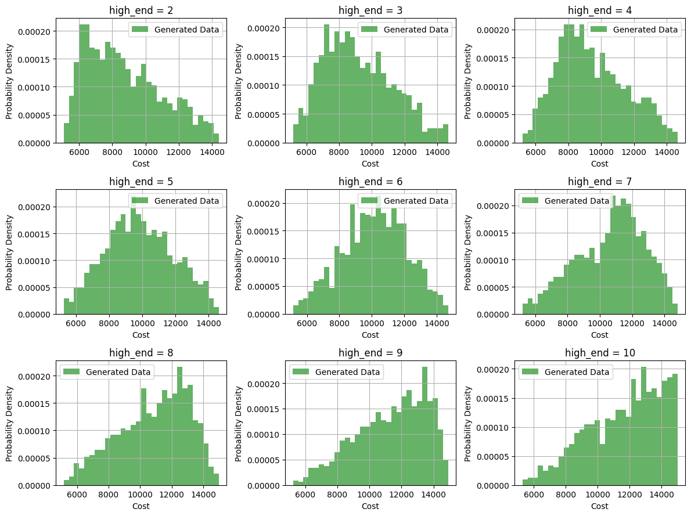
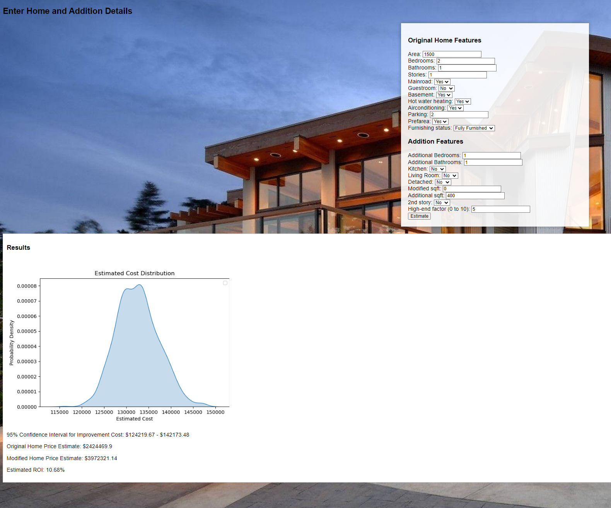

# PHYS243 Final Report 

**Author:** Liam Hsieh 
**SID**: (862395843) 
8/24/2023

## Abstract

This project focuses on property valuation and cost estimation for home improvements using machine learning. We develop predictive models for property valuation and estimate the costs of various home additions, presenting insights through a user-friendly web application. Our linear regression model accurately predicts property values based on factors like square footage and amenities. We introduce the "high-end" factor to simulate training data for cost estimation and use Ridge regression with bootstrapping to estimate addition costs' distribution. Comparing with SVM models, our web application highlights the superior performance of Linear Regression. In conclusion, our project empowers property owners with informed decision-making tools, bridging the gap between data-driven valuation and real estate decisions.

## Introduction

This project delves into the fascinating world of real estate valuation and optimization, aiming to unravel the complex interplay between home improvement features and their influence on property value. By leveraging machine learning and data analysis, we empower homeowners with the insights needed to make informed decisions about property enhancements, maximizing their return on investment (ROI).

Understanding the significance of accurate home improvement valuation is crucial within the real estate market. As a cornerstone of the global economy, real estate represents a major sector with significant financial transactions and investment opportunities. Therefore, precise valuation and prediction of housing prices hold substantial importance for various stakeholders, including homeowners, buyers, sellers, investors, and government institutions. Given the direct impact on these stakeholders, the need for accurate assessments is paramount in facilitating well-informed decisions.

Addressing the challenge of determining optimal value increases from different home improvements, this project develops an analytical framework. Our approach evaluates how mutable property features impact housing prices, providing homeowners with insights into which enhancements yield the most favorable outcomes.

## Problem Statement

In the dynamic landscape of real estate, the decision to undertake home improvements is a strategic one. It involves considering a myriad of factors that could potentially impact the property's value, such as additional square footage, the number of bedrooms and bathrooms, the presence of specific amenities, and even aesthetic enhancements. While the allure of boosting property value through strategic enhancements is enticing, the lack of a systematic approach to quantify the potential return on investment (ROI) often leaves homeowners grappling with uncertainty.

The overarching problem this project addresses is the absence of a comprehensive framework to evaluate the potential ROI associated with various home improvements. Traditional methods for estimating ROI are typically based on anecdotal evidence, general market trends, or advice from real estate agents. This approach, however, lacks the precision and data-driven insights that modern data science techniques can provide.

#### Challenges

Several challenges underpin the complexity of the problem:

**Diverse Home Improvements**: Home enhancements can range from small-scale changes like extra rooms to major modifications like additional stories. Quantifying the effect of these diverse improvements on property value requires an advanced methodology.

**Interplay of Features**: Real estate valuation involves both mutable and non-changeable features. Differentiating the impact of changeable (e.g., added bedroom) from non-changeable aspects is crucial for accurate value assessment.

**Cost Estimation**: Precise estimation of improvement costs is challenging due to variables like scope, materials, and market conditions.

**Property Value Prediction**: Accurate valuation necessitates a robust model capable of capturing intricate feature interactions often overlooked by traditional methods. Modern machine learning techniques offer the capability to address this complexity

#### Objectives  

This project aims to develop a methodology that empowers homeowners to make informed decisions about home improvements and their ROI. Our approach involves predictive property valuation, cost estimation, ROI calculation, and actionable insights. We delve into technical details, outcomes, and implications to revolutionize property enhancement strategies.

## Methodology

Our methodology involves a comprehensive data-driven approach to address the challenges of quantifying the potential return on investment (ROI) associated with home improvements. The process can be divided into three main steps: **Predictive Property Valuation**, **Cost Estimation**, and **ROI Calculation**. 

### Predictive Property Valuation

In this step, we aim to predict property values based on a set of features using linear regression. To introduce the mathematical notation, let's define the following terms:

- $X$: The feature matrix, containing observations as rows and features as columns.
- $y$: The vector of target values (property values).
- $\beta_0, \beta_1, \beta_2, \ldots, \beta_n$: Coefficients to be learned by the linear regression model.
- $\epsilon$: The error term representing the deviations of actual property values from the predicted values.

The linear regression model predicts property values using the equation:

$$ y = \beta_0 + \beta_1 x_1 + \beta_2 x_2 + \ldots + \beta_n x_n + \epsilon $$

Where $x_1, x_2, \ldots, x_n$ are the individual features corresponding to each observation. The coefficients $\beta_0, \beta_1, \beta_2, \ldots, \beta_n$ are estimated during the model training process to minimize the sum of squared errors between the predicted and actual values.

By fitting this model to the Kaggle estate data [1], we establish a quantitative relationship between property features and values. This model enables us to predict property values for new instances and assess the impact of various features on property prices. The predictive property valuation forms the foundation for evaluating the increase in property value resulting from home improvements.

### Cost Estimation

The **Cost Estimation** step involves estimating the cost associated with various home additions, such as adding a bedroom, bathroom, or other features. This process is challenging due to the limited information available for precise cost calculation. To address this, we introduce the concept of a **high-end factor**, which simulates the cost range for different additions.

#### Introducing the High-End Factor

The **high-end factor** is a pivotal element in our methodology, serving as a mechanism to address the challenge posed by the limited information available regarding the cost of house additions. This factor enables us to simulate a range of potential scenarios and generate a training dataset that encapsulates diverse cost possibilities.

Our approach to generating the training dataset involves a process of simulating and accommodating various cost estimates. To achieve this, we employ a **triangular distribution**. This distribution facilitates the creation of random variables that are most likely to cluster around a specific mode ($c$), while also encompassing a range from a lower limit ($a$) to an upper limit ($b$).

In our context, $a$ represents the lower-bound cost, $b$ represents the upper-bound cost, and $c$ is determined based on the high-end factor ($h$). Notably, the high-end factor can take values from 1 to 10, representing different levels of cost estimation.

Mathematically, the mode $c$ is calculated as:

$$ 
c = a + (h - 1) \times \frac{(b - a)}{9} 
$$

, and the triangular distribution is defined by its probability density function (PDF):

$$ 
f(y; a, b, c) = \begin{cases} 
0 & \text{for } y < a \\
\frac{2(y - a)}{(b - a)(c - a)} & \text{for } a \leq y < c \\
\frac{2(b - y)}{(b - a)(b - c)} & \text{for } c \leq y \leq b \\
0 & \text{for } y > b
\end{cases} 
$$

By adjusting the high-end factor ($h$) while keeping $ a $ and $ b $ consistent, we generate various training datasets that reflect a wide spectrum of potential cost ranges for a particular set of house features $\mathbf{x}$. This feature is especially valuable when the available data on addition costs is scarce, as it allows us to explore a diverse set of cost scenarios.

Following figure is an example of how this factor affect the distribution of the cost for house addition.

To provide context, the 'price_data.csv' file serves as a foundational input for the creation of the training dataset that we collected from Angi [1]. This file contains information about the cost of different house additions under specific conditions, including the number of bedrooms, bathrooms, square footage, and other relevant attributes. However, due to the inherent limitations in available data, we leverage the high-end factor to extend the dataset beyond its original scope and generate a comprehensive set of potential cost estimates.

In essence, the high-end factor ($h$) empowers us to address the challenges posed by limited data availability, enabling us to generate a diverse and robust training dataset that underpins our subsequent cost estimation and analysis.

#### Training the Ridge Model

The **Ridge regression model** constitutes a pivotal component in our methodology, facilitating the estimation of house addition costs. This model harnesses the predictive capabilities of linear regression while simultaneously addressing the issue of multicollinearity. To elaborate, multicollinearity refers to the high correlation among independent variables, which can lead to unstable and inaccurate parameter estimates in standard linear regression. Ridge regression combats this by incorporating a regularization term that constrains the magnitudes of the coefficients.

Our approach employs the Ridge regression model to estimate the cost of house additions, considering a range of input parameters that define the addition. These parameters include the number of bedrooms, bathrooms, square footage, presence of a kitchen, living room, and more. To train the Ridge model, we utilize the training dataset generated by the high-end factor ($h$) approach, which provides a diverse and comprehensive range of cost estimates.

Mathematically, the Ridge regression model can be expressed as follows:

$$
\hat{y} = \beta_0 + \beta_1 x_1 + \beta_2 x_2 + \ldots + \beta_p x_p + \alpha \sum_{i=1}^{p} \beta_i^2 
$$

Here, $\hat{y}$ represents the predicted cost of the addition, $\beta_0, \beta_1, \ldots, \beta_p$ are the coefficients, $x_1, x_2, \ldots, x_p$ are the input features, and $\alpha$ is the regularization parameter.

The Ridge regression model is trained using the generated training dataset, incorporating the various parameters that influence addition costs. By fitting the model to this dataset, we obtain a cost estimation mechanism that considers the complexity of these factors and their interplay in determining addition costs.

#### Bootstrapping for Distribution Estimation

Bootstrapping is a fundamental technique employed in statistical analysis to estimate the distribution of a statistic. In our context, it allows us to understand the distribution of predicted addition costs based on a given set of features $\mathbf{x}$ and a high-end factor $h$. This technique provides insight into the variability of our cost predictions and enables us to quantify the uncertainty associated with our estimates.

The bootstrapping process in this project consists of the following steps to estimate the distribution of addition costs for given house features and high-end level:

1. **Generating Bootstrap Sample**: here, a bootstrap sample is a predicted cost value from a particular Ridge regression model which has been trained by an independent generated training dataset using function `pseudo_data()`. Denote that $G$ is a trained Ridge model and $\hat{\beta}$ is set of estimate coefficient sets/hyperparameters, a bootstrap sample $\hat{y}$ would be $G(\mathbf{x};\hat{\beta},h)$

2. **Retraining**: repeat the above step $B$ times as resampling

3. **Cost Estimation**: estimate the cost for house additions based on $B$ bootstrap samples

Mathematically, the bootstrapping procedure can be expressed as follows:

$$
\text{bootstrap cost estimate} = \frac{1}{B}\sum_{b=1}^B \hat{y}_b 
$$

Where $\hat{y}_b$ represents the cost estimates from the Ridge model fitted at the $b$ iteration

By applying bootstrapping, we are equipped to create a distribution of addition costs by all bootstrap sample ($\hat{y}_b, b=1,...,B$) , offering a comprehensive overview of the potential financial implications of house additions. This distribution empowers homeowners to make informed decisions by considering both the average cost estimate and the variability associated with it.

In conclusion, the integration of bootstrapping with the Ridge regression model provides us with a robust framework for estimating the distribution of addition costs. This approach accommodates the complexity of input parameters, quantifies uncertainty, and equips homeowners with a comprehensive understanding of the potential range of financial outcomes associated with different house additions.

### ROI Calculation  
Calculating the Return on Investment (ROI) is a pivotal step in determining the viability of home improvements. ROI quantifies the potential financial gain from property enhancements compared to the cost of implementing those changes. By leveraging the predictive property valuation model and the estimated cost model, we can arrive at a comprehensive understanding of the potential gains homeowners could reap.

#### Formula for ROI
The formula to calculate ROI is as follows:
$$
\text{ROI} = \frac{\text{(Modified Home Price - Original Home Price)} }{\text{ Estimated Cost of Improvements}}-1
$$

, where

- Modified Home Price: the predicted home price after incorporating improvements.
- Original Home Price: the predicted home price before any improvements.
- Estimated Cost of Improvements: the estimated cost of the proposed enhancements.

## Results

### Performance Evaluation of Predictive Models

During the course of our project, we undertook a comprehensive evaluation of different predictive models to determine the most suitable choice for property valuation. One of the prominent models we explored was Support Vector Machine (SVM). However, after meticulous experimentation and analysis, SVM failed to exhibit superior predictive performance compared to our chosen model, Linear Regression. This conclusion was substantiated by empirical metrics that include Mean Squared Error, Variance, and R-squared.

| Model            | Mean Squared Error     | Variance           | R-squared         |
|------------------|------------------------|--------------------|-------------------|
| SVM Model        | 2462511254657.008      | 3498544355820.578  | 0.29613261853888095|
| Linear Regression| 444376843197.3291      | 3498544355820.573  | 0.8729823612331759 |

**SVM Model:**
When employing the Support Vector Machine (SVM) model, we obtained the following performance metrics. The Mean Squared Error (MSE) was calculated to be approximately 2.46 trillion, indicating a high degree of error in prediction. The variance, a measure of the spread of prediction errors, was also quite high at approximately 3.50 trillion. The R-squared value, representing the goodness of fit of the model, was relatively low at around 0.30. These metrics collectively suggest that the SVM model did not perform well in accurately predicting property values.

**Linear Regression Model:**
In stark contrast, the Linear Regression model yielded substantially better results. The Mean Squared Error (MSE) was significantly reduced to approximately 444 billion, indicating a much lower level of prediction error compared to the SVM model. The variance remained similar at around 3.50 trillion. Importantly, the R-squared value increased significantly to approximately 0.87, suggesting a strong correlation between the predicted and actual property values. These metrics collectively demonstrate the superior performance of the Linear Regression model in predicting property values as compared to the SVM model.

These metrics collectively validate the superiority of the Linear Regression model in accurately predicting property values, emphasizing its potential for real-world deployment.

### Web Application: Cost and ROI Estimation

The web application encompasses a range of functionalities tailored to meet the needs of homeowners seeking cost and return-on-investment estimates for home improvements. Some of the notable features include **Intuitive User Interface, Detailed Estimates,Estimated ROI Calculation, Confidence Interval Visualization, User-Friendly Outputs, and Real-Time Interaction**.

### Screen Capture of the Web App

To provide a tangible glimpse of our web application's interface and functionality, we have included a screen capture of the app in action. The capture showcases the user-friendly form where homeowners can input their property details and desired additions. The subsequent results section displays the estimated distribution of addition costs, original and modified home price estimates, and the calculated ROI. This visual representation underscores the user-centered design and practicality of our web app.

In conclusion, our project's results showcase the efficacy of the Linear Regression model in property valuation and the development of a user-friendly web application. By leveraging predictive analytics and providing homeowners with accurate estimates, insights into potential costs, and ROI calculations, we have empowered homeowners to make informed decisions regarding home improvement projects.

## Conclusion

This project delved into property valuation and cost estimation for home improvements, employing a machine learning-based approach. By predicting property values and estimating addition costs, we gained insights into factors influencing property prices and potential ROI.

We introduced a robust linear regression model for property valuation, utilizing features like square footage, bedrooms, bathrooms, and amenities. This model set the stage for subsequent analyses.

For cost estimation, we innovatively introduced the high-end factor, employing a Ridge regression model trained with simulated data via triangular distribution and bootstrapping. This method accounted for limited cost information, enhancing accuracy.

Our web app offers an intuitive interface for users to estimate improvement costs and ROI, using both models. Performance evaluation favored the Linear Regression model over Support Vector Machine (SVM), evidenced by lower Mean Squared Error and higher R-squared values.

In conclusion, data-driven approaches are vital for real estate decisions. Our models aid homeowners, professionals, and investors. Future work may involve advanced techniques and expanded features, adapting to evolving real estate dynamics. Our project lays a foundation for informed property valuation and decision-making processes.

## Reference
[1] Kaggle Housing Price Prediction dataset: https://www.kaggle.com/datasets/harishkumardatalab/housing-price-prediction
[2] House Addition cost: https://www.angi.com/
